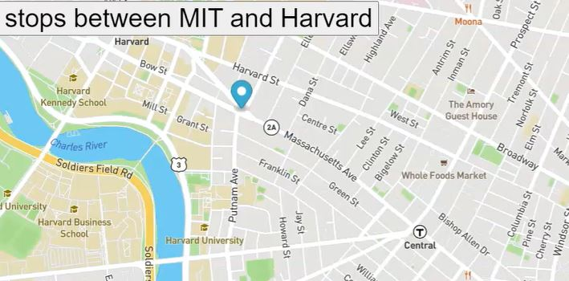

# Real-Time-Bus-Tracking
<h1>Real Time Bus Tracking</h1>

<a href="http://somup.com/crjTnNr1ZR">Video preview</a>
<h2>DESCRIPTION</h2>

This project uses vanilla JavaScript with Mapbox as a tool to view real time map data 
tracking the bus route from MIT and Harvard.

<h2>How to run</h2>
<ul>
<li>Clone the repository into your local environment</li>
<li>Navigate to https://account.mapbox.com/ and create an account</li>
<li>Copy the Default public token or generate your own</li>
<li>Open the mapanimation.js file and add your token in the <your key here></li>
<li>Open the index.html file</li>
<li>Right click and select 'Open Default browser' to open the project in your default browser. </li>
</ul>

<h3>Roadmap of future improvements</h3>

Implement GPS tracking and use that to account for the time interval from the bus moving
from one spot to the next in order to have it be real time data

<h3>Check it out:</h3>
<a href="https://elowskya.github.io/Real-Time-Bus-Tracking/">https://elowskya.github.io/Real-Time-Bus-Tracking/</a>

<h3>License Information</h3>
MIT License

Copyright (c) 2021 Ashley Elowsky

Permission is hereby granted, free of charge, to any person obtaining a copy
of this software and associated documentation files (the "Software"), to deal
in the Software without restriction, including without limitation the rights
to use, copy, modify, merge, publish, distribute, sublicense, and/or sell
copies of the Software, and to permit persons to whom the Software is
furnished to do so, subject to the following conditions:

The above copyright notice and this permission notice shall be included in all
copies or substantial portions of the Software.

THE SOFTWARE IS PROVIDED "AS IS", WITHOUT WARRANTY OF ANY KIND, EXPRESS OR
IMPLIED, INCLUDING BUT NOT LIMITED TO THE WARRANTIES OF MERCHANTABILITY,
FITNESS FOR A PARTICULAR PURPOSE AND NONINFRINGEMENT. IN NO EVENT SHALL THE
AUTHORS OR COPYRIGHT HOLDERS BE LIABLE FOR ANY CLAIM, DAMAGES OR OTHER
LIABILITY, WHETHER IN AN ACTION OF CONTRACT, TORT OR OTHERWISE, ARISING FROM,
OUT OF OR IN CONNECTION WITH THE SOFTWARE OR THE USE OR OTHER DEALINGS IN THE
SOFTWARE.